# Architecture

## Overview

vc-common-service is a multi-tenant API and management UI that provides a **format-agnostic abstraction layer** for Verifiable Credential (VC) operations. It normalizes issue/verify/hold patterns across credential formats (AnonCreds, SD-JWT, mDL, W3C VC) and back-end agents (ACA-Py/Traction, Credo-TS), exposing a single homogeneous REST API to consumers.

---

## System Context

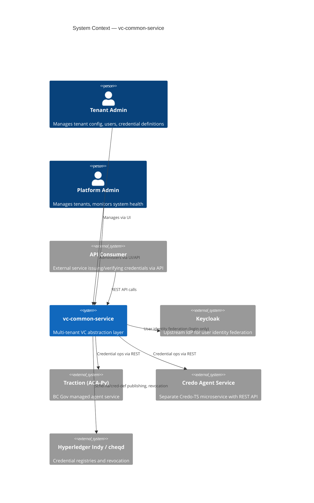
```mermaid
C4Context
    title System Context — vc-common-service

    Person(tenantAdmin, "Tenant Admin", "Manages tenant config, users, credential definitions")
    Person(platformAdmin, "Platform Admin", "Manages tenants, monitors system health")
    System_Ext(apiConsumer, "API Consumer", "External service issuing/verifying credentials via API")

    System(vcService, "vc-common-service", "Multi-tenant VC abstraction layer")

    System_Ext(keycloak, "Keycloak", "Upstream IdP for user identity federation")
    System_Ext(traction, "Traction (ACA-Py)", "BC Gov managed agent service")
    System_Ext(credo, "Credo Agent Service", "Separate Credo-TS microservice with REST API")
    System_Ext(ledger, "Hyperledger Indy / cheqd", "Credential registries and revocation")

    Rel(tenantAdmin, vcService, "Manages via UI")
    Rel(platformAdmin, vcService, "Administers via UI/API")
    Rel(apiConsumer, vcService, "REST API calls")
    Rel(vcService, keycloak, "User identity federation (login only)")
    Rel(vcService, traction, "Credential ops via REST")
    Rel(vcService, credo, "Credential ops via REST")
    Rel(vcService, ledger, "Schema/cred-def publishing, revocation")
```

---

## Technology Stack

| Layer | Technology | Rationale |
|-------|-----------|-----------|
| **API** | NestJS (TypeScript) | Modular architecture, dependency injection, first-class TypeScript, OpenAPI generation, guards/interceptors for cross-cutting concerns |
| **Frontend** | React + Vite + Tailwind + shadcn/ui | Fast DX, typed components, accessible UI primitives, BC Gov design alignment |
| **Database** | PostgreSQL 16 + TypeORM | Relational integrity for multi-tenant data, JSONB for flexible config, mature migration tooling |
| **Cache** | In-memory (per-pod) | Traction token cache, config lookups. No shared cache needed at MVP scale. |
| **Job Queue** | pg-boss (PostgreSQL-backed) | Async credential state updates, webhook dispatch, dead-letter handling. Reuses existing PostgreSQL — no additional infrastructure. Transactional enqueue ensures atomic Operation creation + job dispatch. |
| **Auth** | `oidc-provider` (in-app OIDC server) + Keycloak (upstream identity federation) | App owns token issuance, permissions, and client lifecycle. Keycloak is upstream IdP for user login only. OpenID Certified library handles JWT signing, JWKS, `.well-known`, `client_credentials` grant. |
| **Adapters (MVP)** | Traction REST API | Traction is BC Gov's hosted ACA-Py; sole adapter for MVP. Credo Agent Service adapter deferred to post-MVP |
| **Infra** | Docker Compose (dev), Helm + OpenShift (prod), GitHub Actions (CI/CD) | Standard BC Gov deployment model |

---

## High-Level Architecture

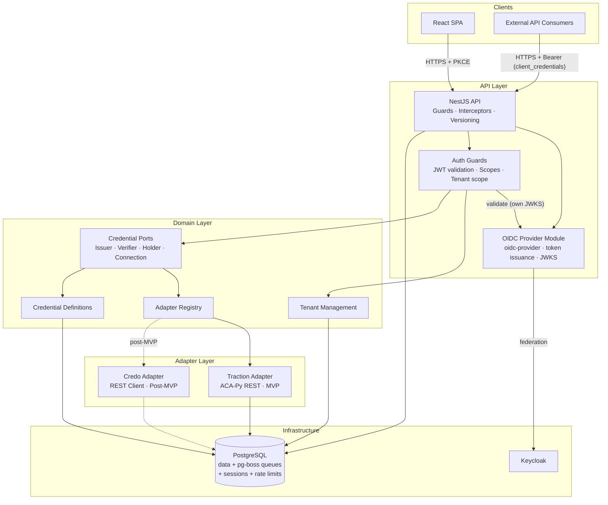
```mermaid
graph TB
    subgraph "Clients"
        UI[React SPA]
        EXT[External API Consumers]
    end

    subgraph "API Layer"
        GW[NestJS API<br/>Guards · Interceptors · Versioning]
        OIDC[OIDC Provider Module<br/>oidc-provider · token issuance · JWKS]
        AUTH[Auth Guards<br/>JWT validation · Scopes · Tenant scope]
    end

    subgraph "Domain Layer"
        TM[Tenant Management]
        PORTS[Credential Ports<br/>Issuer · Verifier · Holder · Connection]
        REG[Adapter Registry]
        CR[Credential Definitions]
    end

    subgraph "Adapter Layer"
        TRAX[Traction Adapter<br/>ACA-Py REST · MVP]
        CREDO[Credo Adapter<br/>REST Client · Post-MVP]
    end

    subgraph "Infrastructure"
        PG[(PostgreSQL<br/>data + pg-boss queues<br/>+ sessions + rate limits)]
        KC[Keycloak]
    end

    UI -->|"HTTPS + PKCE"| GW
    EXT -->|"HTTPS + Bearer (client_credentials)"| GW
    GW --> OIDC
    GW --> AUTH
    OIDC -->|federation| KC
    AUTH -->|"validate (own JWKS)"| OIDC
    AUTH --> TM
    AUTH --> PORTS
    PORTS --> REG
    REG --> TRAX
    REG -.->|post-MVP| CREDO
    PORTS --> CR
    TM --> PG
    CR --> PG
    TRAX --> PG
    CREDO -.-> PG
    GW --> PG
```

---

## Microservice Decomposition

The system is a **modular monolith** deployed as a single NestJS application with clear module boundaries. This avoids premature microservice overhead while keeping the door open for future extraction.

### Module Boundaries

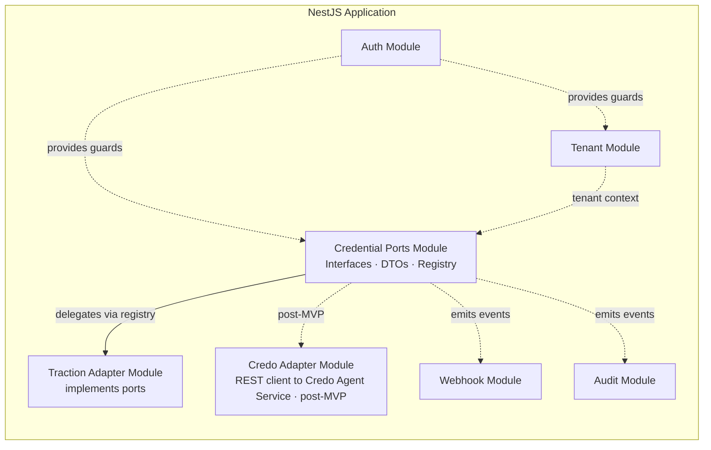
```mermaid
graph LR
    subgraph "NestJS Application"
        direction TB
        AuthMod[Auth Module]
        TenantMod[Tenant Module]
        PortsMod[Credential Ports Module<br/>Interfaces · DTOs · Registry]
        TractionMod[Traction Adapter Module<br/>implements ports]
        CredoMod[Credo Adapter Module<br/>REST client to Credo Agent Service · post-MVP]
        WebhookMod[Webhook Module]
        AuditMod[Audit Module]
    end

    AuthMod -.->|provides guards| TenantMod
    AuthMod -.->|provides guards| PortsMod
    TenantMod -.->|tenant context| PortsMod
    PortsMod -->|delegates via registry| TractionMod
    PortsMod -.->|post-MVP| CredoMod
    PortsMod -.->|emits events| WebhookMod
    PortsMod -.->|emits events| AuditMod
```

| Module | Responsibility | Extractable? |
|--------|---------------|--------------|
| **Auth** | JWT validation, RBAC guards, tenant-scoping, API key auth | Shared library |
| **Tenant** | Tenant CRUD, user management, config, quotas | Yes — separate service |
| **Credential (Ports)** | Port interfaces, DTOs, adapter registry, orchestration | Yes — core service |
| **Traction Adapter** | Implements all ports against ACA-Py/Traction REST API | Plugin (MVP) |
| **Credo Adapter** | Implements all ports against Credo Agent Service REST API (same pattern as Traction) | Plugin (post-MVP) |
| **Webhook** | Registration, HMAC-signed dispatch, retry logic | Yes — worker service |
| **Audit** | Append-only log writes, query interface | Yes — event sink |

**Why modular monolith over microservices:**
- Team is small; operational overhead of 5+ services is premature
- Shared PostgreSQL keeps transactional consistency simple
- Module boundaries are enforced via NestJS DI — extraction is mechanical when needed
- Single deployment artifact simplifies OpenShift configuration

---

## Credential Adapter Layer (Ports & Adapters)

The core design challenge: multiple credential formats × multiple back-end agents = combinatorial complexity. We solve this with the **Adapter Pattern** (hexagonal architecture / ports & adapters):

- **Ports** — abstract interfaces defining *what* the system can do (issue, verify, hold, connect). These are stable, prescriptive, and format-agnostic.
- **Adapters** — concrete implementations that translate port calls into agent-specific REST API calls (Traction adapter, future Credo adapter, etc.).

The API surface is **prescriptive** — it uses high-level, agent-agnostic operation names. Callers never reference Traction, ACA-Py, or Credo concepts directly.

### Port Interfaces


```mermaid
classDiagram
    class IssuerPort {
        <<interface>>
        +offerCredential(req: OfferCredentialRequest): Promise~CredentialExchange~
        +getExchange(id: string): Promise~CredentialExchange~
    }
    class VerifierPort {
        <<interface>>
        +requestPresentation(req: PresentationRequest): Promise~PresentationExchange~
        +getPresentation(id: string): Promise~PresentationExchange~
    }
    class HolderPort {
        <<interface>>
        +acceptOffer(exchangeId: string): Promise~CredentialExchange~
        +rejectOffer(exchangeId: string): Promise~void~
    }
    class ConnectionPort {
        <<interface>>
        +createInvitation(opts: InvitationOptions): Promise~Invitation~
        +acceptInvitation(url: string): Promise~Connection~
        +list(filters: ConnectionFilters): Promise~Connection[]~
        +getById(id: string): Promise~Connection~
    }
    class RevocationPort {
        <<interface>>
        +revoke(credentialId: string): Promise~RevocationResult~
        +batchRevoke(ids: string[]): Promise~RevocationResult[]~
    }

    class TractionAdapter {
        -httpClient: HttpService
        -tokenCache: TractionTokenManager
        +offerCredential()
        +requestPresentation()
        +acceptOffer()
        +createInvitation()
        +revoke()
    }
    class CredoAdapter {
        -httpClient: AxiosInstance
        -baseUrl: string
        +offerCredential()
        +requestPresentation()
        +acceptOffer()
        +createInvitation()
        +revoke()
    }

    IssuerPort <|.. TractionAdapter
    VerifierPort <|.. TractionAdapter
    HolderPort <|.. TractionAdapter
    ConnectionPort <|.. TractionAdapter
    RevocationPort <|.. TractionAdapter

    IssuerPort <|.. CredoAdapter
    VerifierPort <|.. CredoAdapter
    HolderPort <|.. CredoAdapter
    ConnectionPort <|.. CredoAdapter
    RevocationPort <|.. CredoAdapter
```

### Adapter Registry

At startup, adapters register themselves in an `AdapterRegistry`. The registry resolves which adapter to use based on the tenant's configured connector and the requested credential format.

```typescript
// Pseudocode — NestJS provider
@Injectable()
export class AdapterRegistry {
  private adapters = new Map<ConnectorType, AgentAdapter>();

  register(type: ConnectorType, adapter: AgentAdapter): void;

  resolve(tenant: Tenant, format?: CredentialFormat): AgentAdapter {
    // 1. Look up tenant.config.default_connector (UUID)
    // 2. Load ConnectorCredential by UUID → get connector_type
    // 3. Resolve adapter by connector_type from registry
    // 4. If format omitted, derive from connector's primary supported format
    // 5. Validate format is supported by that adapter
    // 6. Return adapter instance (or throw UnsupportedFormatError)
  }
}
```

### API Routing Strategy (Recommendation: Hybrid)

The API uses a **hybrid** approach for identifying credential format and backend service:

| Concern | Mechanism | Rationale |
|---------|-----------|----------|
| **Operation** | Path segment | REST-natural; `/credentials/offer`, `/presentations/request` are self-describing |
| **Credential format** | Resolved from profile (implicit) | Consumers don't need to know format details — profile abstracts it |
| **Backend service** | Resolved from profile → connector (implicit) | Callers shouldn't need to know which agent backs their tenant — the abstraction's whole point |
| **Protocol (DIDComm vs OID4VCI)** | Presence/absence of `connection_id` | DIDComm needs an existing connection; OID4VCI is connectionless |
| **Backend override** | Query param `?adapter=traction` | Escape hatch for platform-admins; optional, ignored in v1 MVP |

**Example endpoints (prescriptive naming):**

```
POST /api/v1/tenants/:tenantId/credentials/offer      → Issue/offer a credential
POST /api/v1/tenants/:tenantId/presentations/request   → Request a presentation/proof
POST /api/v1/tenants/:tenantId/credentials/:id/accept  → Accept a credential offer (holder)
POST /api/v1/tenants/:tenantId/credentials/:id/revoke  → Revoke an issued credential
POST /api/v1/tenants/:tenantId/connections             → Create connection invitation
GET  /api/v1/tenants/:tenantId/connections             → List connections
GET  /api/v1/tenants/:tenantId/operations/:id          → Poll operation status/result (AG-02)
POST /api/v1/tenants/:tenantId/profiles/issuance       → Create issuance profile
POST /api/v1/tenants/:tenantId/profiles/verification   → Create verification profile
GET  /api/v1/issuers/:tenantSlug/.well-known/openid-credential-issuer → Public discovery
```

**Request body example (issue via profile — DIDComm delivery):**
```json
{
  "profile_id": "drivers-license/1.0",
  "connection_id": "uuid",
  "attributes": { "given_name": "Alice", "family_name": "Smith", "birth_date": "1995-03-15" }
}
```

**Request body example (issue via profile — OID4VCI delivery, connectionless):**
```json
{
  "profile_id": "drivers-license/1.0",
  "attributes": { "given_name": "Alice", "family_name": "Smith", "birth_date": "1995-03-15" }
}
```

When `connection_id` is absent, the adapter generates a `credential_offer_uri` that the holder opens in their wallet. The profile's `protocol_hint` and adapter capabilities determine the exact protocol used.

**Legacy mode** (direct format + cred_def — still supported):
```json
{
  "connection_id": "uuid",
  "credential_definition_id": "uuid",
  "format": "anoncreds",
  "attributes": { "given_name": "Alice", "birth_date": "1995-03-15" }
}
```

### Credential Profiles

Profiles are the primary consumer-facing abstraction. They encapsulate credential format, schema, connector, and protocol details behind a stable, named identifier. This concept aligns with **OID4VCI Credential Configurations** (§10.2).

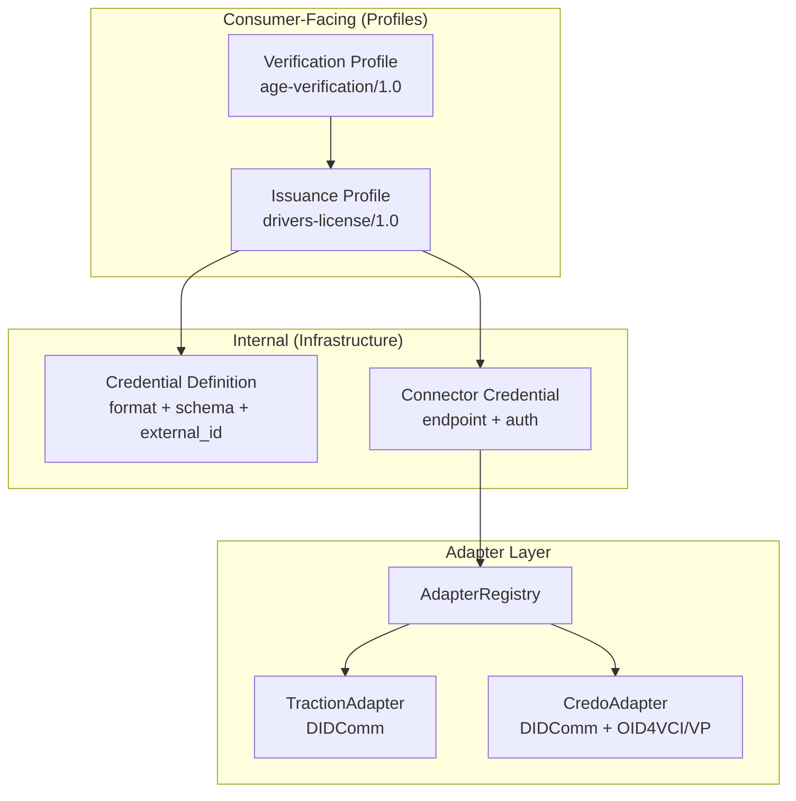
```mermaid
graph TD
    subgraph "Consumer-Facing (Profiles)"
        IP[Issuance Profile<br/>drivers-license/1.0]
        VP[Verification Profile<br/>age-verification/1.0]
    end

    subgraph "Internal (Infrastructure)"
        CD[Credential Definition<br/>format + schema + external_id]
        CC[Connector Credential<br/>endpoint + auth]
    end

    subgraph "Adapter Layer"
        AR[AdapterRegistry]
        TA[TractionAdapter<br/>DIDComm]
        CA[CredoAdapter<br/>DIDComm + OID4VCI/VP]
    end

    IP --> CD
    IP --> CC
    VP --> IP
    CC --> AR
    AR --> TA
    AR --> CA
```

**Key design decisions:**
- **Name + version** as identifier: enables schema evolution (deprecate v1.0, publish v2.0)
- **Profile wraps cred_def**: consumers never reference `credential_definition_id` or `format` directly
- **Lifecycle (draft → published → deprecated)**: prevents issuing against incomplete or retired configurations
- **Verification profiles reference issuance profiles**: ensures requested attributes actually exist in the issued credential
- **Public discovery**: verification profiles can be marked public for external verifier consumption
- **Protocol hint**: profiles declare preferred delivery protocol; adapters honor or auto-detect

### Multi-Protocol Delivery (DIDComm + OID4VCI/VP)

The service supports two credential exchange protocols, selected at request time based on `connection_id` presence:

| | DIDComm | OID4VCI / OID4VP |
|---|---|---|
| **When** | `connection_id` provided | `connection_id` absent |
| **Prerequisite** | Existing peer connection (CA-06) | None — generates one-time URI |
| **Issuance flow** | Issuer pushes offer → holder agent auto-negotiates | Holder opens `credential_offer_uri` → authorization → retrieves credential |
| **Verification flow** | Verifier sends proof request → holder agent responds | Holder opens `authorization_request_uri` → presents via wallet |
| **Response** | 202 Accepted (async, webhook-driven) | 200 with URI in result (issuer's part done; holder acts later) |
| **State tracking** | Webhook → ME-02 updates Operation | Webhook from agent when holder completes flow |
| **MVP adapter** | TractionAdapter (DIDComm-only) | Post-MVP via CredoAdapter |
| **Standards** | Aries RFC 0453/0454, DIDComm v1/v2 | OID4VCI draft-14+, OID4VP draft-20+, DIF PE |

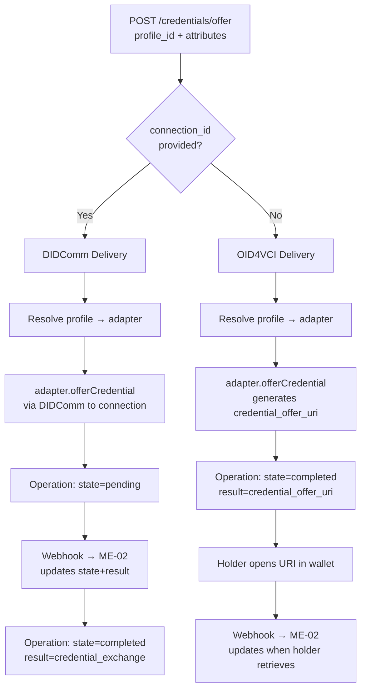
```mermaid
flowchart TD
    REQ[POST /credentials/offer<br/>profile_id + attributes]
    REQ --> CHECK{connection_id<br/>provided?}

    CHECK -->|Yes| DIDCOMM[DIDComm Delivery]
    CHECK -->|No| OID4VCI[OID4VCI Delivery]

    DIDCOMM --> RESOLVE1[Resolve profile → adapter]
    RESOLVE1 --> SEND[adapter.offerCredential<br/>via DIDComm to connection]
    SEND --> OP1[Operation: state=pending]
    OP1 --> WH[Webhook → ME-02<br/>updates state+result]
    WH --> DONE1[Operation: state=completed<br/>result=credential_exchange]

    OID4VCI --> RESOLVE2[Resolve profile → adapter]
    RESOLVE2 --> GEN[adapter.offerCredential<br/>generates credential_offer_uri]
    GEN --> OP2[Operation: state=completed<br/>result=credential_offer_uri]
    OP2 --> HOLDER[Holder opens URI in wallet]
    HOLDER --> WH2[Webhook → ME-02<br/>updates when holder retrieves]
```

**Why both protocols:**
- DIDComm: mature, proven in BC Gov ecosystem (Traction), agent-to-agent automation
- OID4VCI/VP: emerging standard for wallet interop (EU EUDI, mDL), mobile-first UX (QR → deep-link)
- Same credential, different delivery — profile defines WHAT, protocol determines HOW

### Request Flow (Profile Resolution + Adapter)

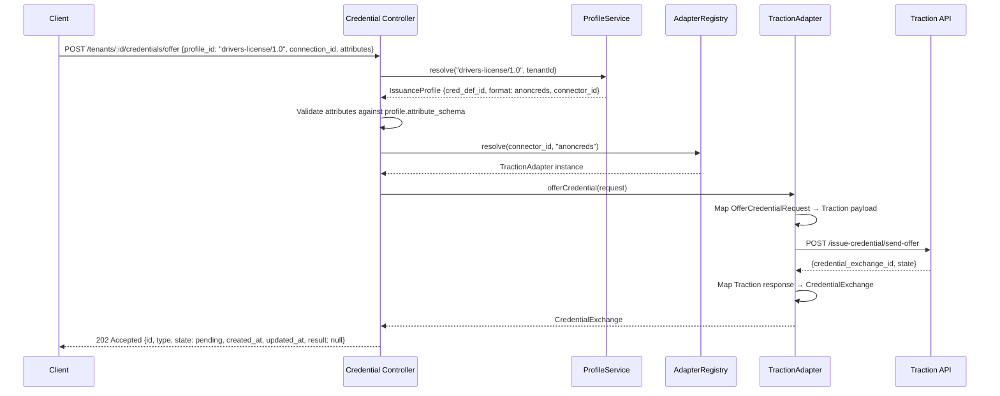
```mermaid
sequenceDiagram
    participant Client
    participant Controller as Credential Controller
    participant ProfileSvc as ProfileService
    participant Registry as AdapterRegistry
    participant Adapter as TractionAdapter
    participant Traction as Traction API

    Client->>Controller: POST /tenants/:id/credentials/offer {profile_id: "drivers-license/1.0", connection_id, attributes}
    Controller->>ProfileSvc: resolve("drivers-license/1.0", tenantId)
    ProfileSvc-->>Controller: IssuanceProfile {cred_def_id, format: anoncreds, connector_id}
    Controller->>Controller: Validate attributes against profile.attribute_schema
    Controller->>Registry: resolve(connector_id, "anoncreds")
    Registry-->>Controller: TractionAdapter instance
    Controller->>Adapter: offerCredential(request)
    Adapter->>Adapter: Map OfferCredentialRequest → Traction payload
    Adapter->>Traction: POST /issue-credential/send-offer
    Traction-->>Adapter: {credential_exchange_id, state}
    Adapter->>Adapter: Map Traction response → CredentialExchange
    Adapter-->>Controller: CredentialExchange
    Controller-->>Client: 202 Accepted {id, type, state: pending, created_at, updated_at, result: null}
```

### Initial Implementation: Traction-First

The MVP ships with **only the Traction adapter**. The adapter interfaces are designed and tested, but the Credo adapter is deferred to post-MVP.

| Phase | Adapters Available | Formats | Protocols |
|-------|-------------------|---------|-----------|
| **MVP** | TractionAdapter | AnonCreds (primary), W3C VC (if Traction supports) | DIDComm v1 |
| **Post-MVP** | TractionAdapter + CredoAdapter | + SD-JWT, mDL via Credo Agent Service | + OID4VCI/VP, DIDComm v2 |
| **Future** | Any adapter implementing ports | Extensible by third parties | Protocol per adapter |

This means:
- Port interfaces are defined and unit-tested against mocks in MVP
- TractionAdapter is the only production adapter in MVP (DIDComm delivery only)
- OID4VCI/VP delivery requires an OID4VCI-capable adapter (post-MVP) — in MVP, omitting `connection_id` returns 400 (PROTOCOL_NOT_SUPPORTED) because Traction only supports DIDComm. The API shape supports both protocols by design; connectionless delivery becomes functional when an OID4VCI-capable adapter (e.g., CredoAdapter) is registered.
- Profiles are fully functional in MVP (resolve format + cred_def + connector transparently)
- Credo adapter work items are P2 (backlog) — architecture supports them but code is not written
- The Credo adapter is a REST client (same pattern as Traction), NOT an embedded agent — the Credo Agent Service runs as a separate microservice
- The `AdapterRegistry` still exists in MVP (with one registered adapter) to prove the pattern works

### Why Credo Runs as a Separate Service

The vc-common-service is a **VC service layer** — it orchestrates credential operations, manages tenants, and exposes a uniform API. Agent runtimes (Traction, Credo) are **infrastructure concerns** that should live outside this layer.

| Factor | Embedded Agent (rejected) | Separate Credo Agent Service |
|--------|--------------------------|------------------------------|
| **Separation of concerns** | vc-common-service becomes tightly coupled to Credo SDK, wallet storage, DIDComm transport | vc-common-service remains a pure orchestration layer; agent complexity is encapsulated |
| **Deployment independence** | Credo version upgrades require redeploying the entire API | Agent service can be upgraded, scaled, and rolled back independently |
| **Resource isolation** | Credo's wallet operations, DIDComm message processing, and ledger interactions compete for CPU/memory with API request handling | Agent workload runs in its own pod with dedicated resources |
| **Multi-tenancy** | Must manage per-tenant Credo agent instances or shared agent with tenant isolation inside the process | Agent service owns its own multi-tenancy model (same as Traction) |
| **Consistency** | Two fundamentally different adapter patterns: HTTP client (Traction) vs embedded SDK (Credo) | Both adapters are HTTP clients — same error handling, retry logic, circuit breaker, and observability patterns |
| **Team boundaries** | Agent expertise required in the vc-common-service codebase | Agent service can be maintained by a team with Credo/DIDComm expertise |
| **Testing** | Integration tests require full Credo agent setup (wallet, ledger, mediator) | Adapter tests are simple HTTP mocks (same as Traction tests) |

The Credo Agent Service exposes a REST API that mirrors the operations vc-common-service needs: issue, verify, hold, connect, revoke. It receives webhook callbacks from the DIDComm layer and forwards state changes to vc-common-service via the same webhook ingestion endpoint Traction uses.

---

## Why pg-boss (PostgreSQL-Backed Job Queue)

Credential operations are inherently **asynchronous**. A holder must accept an offer, a verifier must wait for a presentation. This creates a fundamental mismatch with synchronous REST request/response cycles.

### Why pg-boss Over RabbitMQ

| Factor | pg-boss | RabbitMQ (rejected) |
|--------|---------|---------------------|
| **Infrastructure** | Zero — reuses existing PostgreSQL | Separate StatefulSet, operator, PVCs |
| **Transactional enqueue** | Same DB transaction: INSERT Operation + enqueue job = atomic | Two-phase: write Operation → publish message (can lose messages) |
| **Dead-letter** | Built-in (`deadLetter` option per queue) | Separate DLX/DLQ config |
| **Retry + backoff** | Built-in `retryLimit`, `retryDelay`, `retryBackoff` | Manual (re-publish with delay exchange) |
| **Scheduling** | Built-in `startAfter`, cron schedules | Requires delayed message plugin |
| **Monitoring** | Query `pgboss.job` table directly | Requires Management UI or Prometheus exporter |
| **Dev setup** | Already have PostgreSQL | Extra Docker Compose service |
| **OpenShift deploy** | Nothing additional | RabbitMQ Helm chart + NetworkPolicies |

### Problems Solved

| Problem | Solution |
|---------|----------|
| **Async credential flow** | API returns 202 immediately; pg-boss workers process state updates as Traction/Credo report progress |
| **Webhook reliability** | `webhook.dispatch` queue with built-in retry (`retryLimit: 3, retryBackoff: true`) + dead-letter on final failure |
| **Atomic enqueue** | Operation record + job created in same PostgreSQL transaction — impossible to lose a message |
| **Backpressure** | pg-boss `batchSize` + `teamConcurrency` control processing rate |
| **Failure isolation** | A failing webhook worker doesn't block credential issuance (separate queues) |
| **Ordered processing** | pg-boss `singletonKey` per tenant ensures state transitions don't race |

### Message Flow

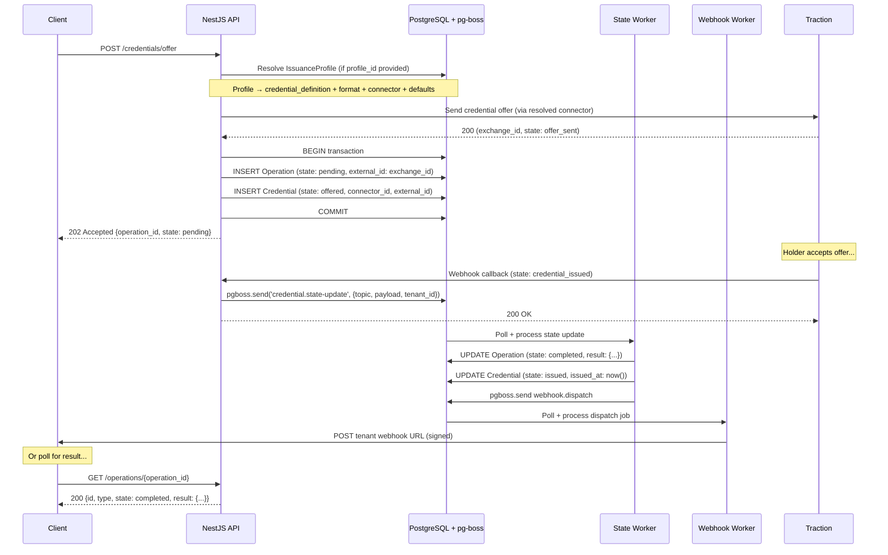
```mermaid
sequenceDiagram
    participant Client
    participant API as NestJS API
    participant PG as PostgreSQL + pg-boss
    participant Worker as State Worker
    participant WebhookW as Webhook Worker
    participant Traction

    Client->>API: POST /credentials/offer
    API->>PG: Resolve IssuanceProfile (if profile_id provided)
    Note over API,PG: Profile → credential_definition + format + connector + defaults
    API->>Traction: Send credential offer (via resolved connector)
    Traction-->>API: 200 (exchange_id, state: offer_sent)
    API->>PG: BEGIN transaction
    API->>PG: INSERT Operation (state: pending, external_id: exchange_id)
    API->>PG: INSERT Credential (state: offered, connector_id, external_id)
    API->>PG: COMMIT
    API-->>Client: 202 Accepted {operation_id, state: pending}

    Note over Traction: Holder accepts offer...

    Traction->>API: Webhook callback (state: credential_issued)
    API->>PG: pgboss.send('credential.state-update', {topic, payload, tenant_id})
    API-->>Traction: 200 OK
    PG->>Worker: Poll + process state update
    Worker->>PG: UPDATE Operation (state: completed, result: {...})
    Worker->>PG: UPDATE Credential (state: issued, issued_at: now())
    Worker->>PG: pgboss.send webhook.dispatch
    PG->>WebhookW: Poll + process dispatch job
    WebhookW->>Client: POST tenant webhook URL (signed)

    Note over Client: Or poll for result...
    Client->>API: GET /operations/{operation_id}
    API-->>Client: 200 {id, type, state: completed, result: {...}}
```

---

## Why No Redis (PostgreSQL Handles All Roles)

At MVP scale, every role traditionally filled by Redis can be served by PostgreSQL or in-memory caches, eliminating a separate infrastructure dependency.

| Role | Traditional (Redis) | Our Approach (PostgreSQL / In-Memory) |
|------|--------------------|-----------------------------------------|
| **OIDC sessions & grants** | Redis adapter for oidc-provider | PostgreSQL adapter — `oidc_sessions` table with TTL; pg-boss scheduled cleanup job |
| **Rate limiting** | Sliding window counters | `rate_limit_hits` table + indexed `hit_at` column; `SELECT count(*)` with time window |
| **Idempotency keys** | SETNX + TTL | `idempotency_keys` table; `INSERT ... ON CONFLICT` for atomic check-and-lock |
| **Distributed locks** | SETNX / Redlock | `pg_advisory_lock` / `pg_try_advisory_lock` (built into PostgreSQL) |
| **Traction token cache** | Key with TTL | In-memory `Map` with TTL per pod (tokens are short-lived, cheap to re-fetch) |
| **General cache** | cache-manager-redis-store | In-memory cache-manager (default store); per-pod, no shared state needed |

### Trade-offs

- **Rate limiting at extreme scale**: PostgreSQL `count(*)` is heavier than Redis `INCR`. Mitigated by index on `(tenant_id, endpoint, hit_at)` and periodic cleanup. If a single tenant exceeds thousands of requests/second, Redis can be re-introduced for this single role post-MVP.
- **Session store write load**: oidc-provider creates/updates sessions on every auth flow. At MVP tenant counts (~tens), this is negligible. PostgreSQL connection pooling (built into TypeORM) handles this easily.
- **No shared cache across pods**: Each pod caches Traction tokens independently. This means slightly more `/multitenancy/token` calls, but these are lightweight HTTP round-trips.

### Infrastructure Simplification

With Redis removed, the entire infrastructure is:
- **Dev**: Docker Compose with `app` + `PostgreSQL` + `Keycloak` (3 services; optional Loki via DITP-DevOps wiki pattern for log aggregation)
- **Prod**: API pod + Worker pod + PostgreSQL + Keycloak (no Redis StatefulSet, no Redis Sentinel/HA)
- **Loki**: Assumed pre-existing in deployed environments (not provisioned by this project's Helm chart)

---

## Operation Tracking & Polling

### Design Principle

Backend agents (Traction, Credo Agent Service) communicate results via webhooks — but the API caller needs a way to retrieve results. The service uses a **dual-response pattern**:

| Response Type | When | HTTP Status | Caller Experience |
|---------------|------|-------------|-------------------|
| **Synchronous** | Operation completes within request timeout (e.g., creating an invitation, listing connections) | 200 | Result in response body directly |
| **Asynchronous** | Operation requires external party action or agent processing (e.g., issue credential, request presentation) | 202 Accepted | Response contains `operation_id`; caller polls or listens via webhook |

Both types create an Operation record — synchronous results are also pollable (useful for idempotent retries or if the caller's connection drops).

### Operation Model

Stored in PostgreSQL using **JSONB** for the flexible `result` column:

```sql
CREATE TABLE operations (
    id              UUID PRIMARY KEY DEFAULT gen_random_uuid(),
    tenant_id       UUID NOT NULL REFERENCES tenants(id),
    batch_id        UUID REFERENCES operations(id),  -- NULL for standalone ops; FK to parent batch operation
    type            VARCHAR(50) NOT NULL,     -- e.g., 'credential.offer', 'credential.offer-batch', 'credential.revoke-batch'
    state           VARCHAR(20) NOT NULL,     -- 'pending' | 'processing' | 'completed' | 'failed'
    request         JSONB NOT NULL,           -- { method, path, body } — full request context for /request endpoint
    result          JSONB,                    -- state-dependent: null (pending), result (completed), error (failed)
    external_id     VARCHAR(255),             -- agent's exchange_id / connection_id for correlation
    viewed_at       TIMESTAMPTZ,             -- first time caller retrieved the result
    expires_at      TIMESTAMPTZ NOT NULL,     -- TTL: when this record becomes eligible for purge
    created_at      TIMESTAMPTZ NOT NULL DEFAULT now(),
    updated_at      TIMESTAMPTZ NOT NULL DEFAULT now()
);

CREATE INDEX idx_operations_tenant_state ON operations (tenant_id, state);
CREATE INDEX idx_operations_tenant_type_state ON operations (tenant_id, type, state);
CREATE INDEX idx_operations_tenant_created ON operations (tenant_id, created_at DESC);
CREATE INDEX idx_operations_external_id ON operations (external_id);
CREATE INDEX idx_operations_expires_at ON operations (expires_at) WHERE expires_at < now();
CREATE INDEX idx_operations_batch_id ON operations (batch_id) WHERE batch_id IS NOT NULL;
```

### Polling Endpoint

```
GET /api/v1/tenants/:tenantId/operations/:operationId
```

Response uses a consistent envelope — every response has the same 6 top-level fields.
Result semantics determined by `(type, state)`:

```json
// Pending — result is null
{ "id": "uuid", "type": "credential.offer", "state": "pending",
  "created_at": "...", "updated_at": "...", "result": null }

// Completed — result contains operation-type-specific data
{ "id": "uuid", "type": "credential.offer", "state": "completed",
  "created_at": "...", "updated_at": "...",
  "result": { "credential_exchange_id": "...", "state": "credential_issued", "attributes": {...} } }

// Failed — result contains { code, message }
{ "id": "uuid", "type": "credential.offer", "state": "failed",
  "created_at": "...", "updated_at": "...",
  "result": { "code": "ADAPTER_TIMEOUT", "message": "Traction did not respond within 30s" } }

// Batch parent (processing) — result contains progress (computed at read time)
{ "id": "uuid", "type": "credential.offer-batch", "state": "processing",
  "created_at": "...", "updated_at": "...",
  "result": { "total": 200, "completed": 142, "failed": 3, "pending": 55 } }

// Batch parent (completed) — result contains final summary
{ "id": "uuid", "type": "credential.offer-batch", "state": "completed",
  "created_at": "...", "updated_at": "...",
  "result": { "total": 200, "completed": 197, "failed": 3, "errors": [...] } }
```

Original request details accessible via sub-resource:
```
GET /api/v1/tenants/:tenantId/operations/:operationId/request
```

Response:
```json
{
  "method": "POST",
  "path": "/api/v1/tenants/b7e4a1f0-.../credentials/offer",
  "body": { "profile_id": "drivers-license/1.0", "connection_id": "uuid", "attributes": { "given_name": "Alice", "birth_date": "1995-03-15" } }
}
```

> **⚠️ PII concern:** The `body` field contains the original request payload including credential attributes (names, dates of birth, addresses, government IDs). This data is already accessible to the caller who submitted it, but care must be taken:
> - Data is transient (purged with the Operation on TTL expiry — not a permanent store)
> - Access is logged in the audit trail
> - Future: optional per-tenant field-level redaction policy (P2)

Batch child items are accessible via sub-resource:
```
GET /api/v1/tenants/:tenantId/operations/:batchOperationId/items?state=failed&limit=20
```

List operations (with filtering):
```
GET /api/v1/tenants/:tenantId/operations?state=pending&type=credential.offer&limit=20
```

### TTL and Purge Strategy

Operations are transient — they're not the long-term audit trail (that's the audit log). Purge rules:

| Condition | TTL | Rationale |
|-----------|-----|-----------|
| Completed + viewed | 1 hour after `viewed_at` | Caller got the result; no need to retain |
| Completed + not viewed | 72 hours after `created_at` | Grace period for polling |
| Failed + viewed | 24 hours after `viewed_at` | Longer retention for debugging |
| Failed + not viewed | 7 days after `created_at` | Unacknowledged failures need investigation |
| Pending (stale) | 24 hours after `created_at` | Likely abandoned or agent never responded |

The `expires_at` field is computed at creation (default: 72h) and updated when `viewed_at` is set (shortened to 1h). A scheduled job (cron or pg_cron) purges expired records:

```sql
DELETE FROM operations WHERE expires_at < now();
```

### Flow: Synchronous Operation (e.g., Create Invitation)

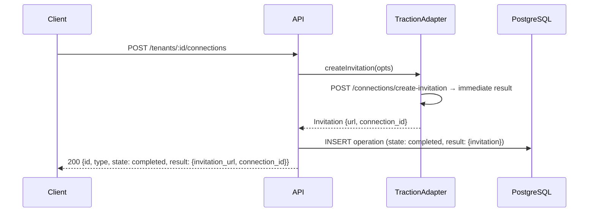
```mermaid
sequenceDiagram
    participant Client
    participant API
    participant Adapter as TractionAdapter
    participant DB as PostgreSQL

    Client->>API: POST /tenants/:id/connections
    API->>Adapter: createInvitation(opts)
    Adapter->>Adapter: POST /connections/create-invitation → immediate result
    Adapter-->>API: Invitation {url, connection_id}
    API->>DB: INSERT operation (state: completed, result: {invitation})
    API-->>Client: 200 {id, type, state: completed, result: {invitation_url, connection_id}}
```

### Flow: Asynchronous Operation (e.g., Offer Credential)

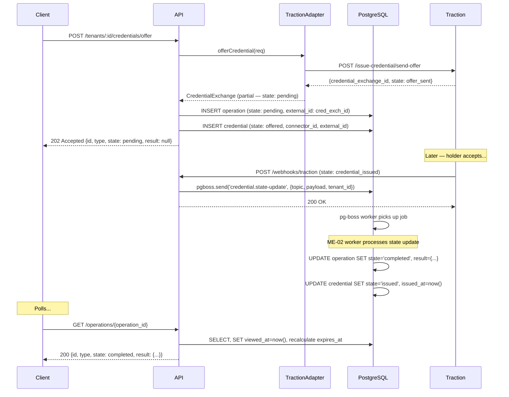
```mermaid
sequenceDiagram
    participant Client
    participant API
    participant Adapter as TractionAdapter
    participant DB as PostgreSQL
    participant Traction

    Client->>API: POST /tenants/:id/credentials/offer
    API->>Adapter: offerCredential(req)
    Adapter->>Traction: POST /issue-credential/send-offer
    Traction-->>Adapter: {credential_exchange_id, state: offer_sent}
    Adapter-->>API: CredentialExchange (partial — state: pending)
    API->>DB: INSERT operation (state: pending, external_id: cred_exch_id)
    API->>DB: INSERT credential (state: offered, connector_id, external_id)
    API-->>Client: 202 Accepted {id, type, state: pending, result: null}

    Note over Traction: Later — holder accepts...

    Traction->>API: POST /webhooks/traction (state: credential_issued)
    API->>DB: pgboss.send('credential.state-update', {topic, payload, tenant_id})
    API-->>Traction: 200 OK
    DB->>DB: pg-boss worker picks up job
    Note over DB: ME-02 worker processes state update
    DB->>DB: UPDATE operation SET state='completed', result={...}
    DB->>DB: UPDATE credential SET state='issued', issued_at=now()
    Note over Client: Polls...
    Client->>API: GET /operations/{operation_id}
    API->>DB: SELECT, SET viewed_at=now(), recalculate expires_at
    API-->>Client: 200 {id, type, state: completed, result: {...}}
```

### Webhook Correlation

When Traction sends a webhook, CT-06 enqueues it immediately. The ME-02 worker then correlates it to the correct Operation via `external_id`:

1. Traction webhook arrives with `credential_exchange_id` = "abc-123"
2. CT-06 enqueues to pg-boss `credential.state-update` queue → returns 200 to Traction
3. ME-02 worker picks up job, queries: `SELECT * FROM operations WHERE external_id = 'abc-123'`
4. Updates Operation state + result JSONB
5. Updates Credential record state (offered → issued)
6. Recalculates `expires_at` based on new state
7. Emits domain event → triggers webhook dispatch if tenant has listeners

### pg-boss Queue Topology

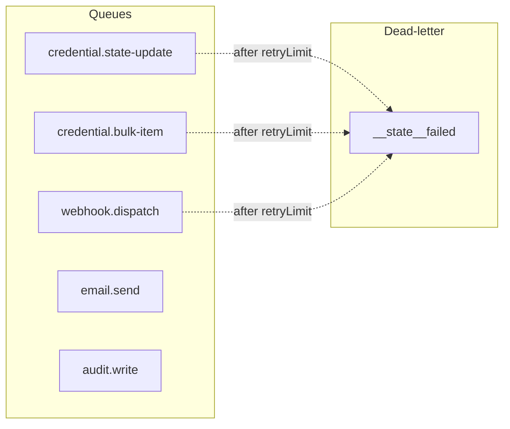
```mermaid
graph LR
    subgraph "Queues"
        CSU[credential.state-update]
        BLK[credential.bulk-item]
        WDQ[webhook.dispatch]
        EML[email.send]
        AUD[audit.write]
    end

    subgraph "Dead-letter"
        DLQ[__state__failed]
    end

    CSU -.->|after retryLimit| DLQ
    BLK -.->|after retryLimit| DLQ
    WDQ -.->|after retryLimit| DLQ
```

### Bulk Operations

Bulk issuance and revocation allow a tenant to process hundreds of credentials in a single API call. The design ensures the main process is never blocked:

**Why no worker threads:**
- Every "heavy" operation is an HTTP POST to an external agent service (Traction, Credo Agent Service) — I/O-bound, not CPU-bound
- Node.js handles I/O concurrency natively with async/await
- pg-boss workers are lightweight async functions polling a PostgreSQL table
- **Horizontal scaling (more Worker pod replicas) is the correct and simplest solution**

**Flow:**

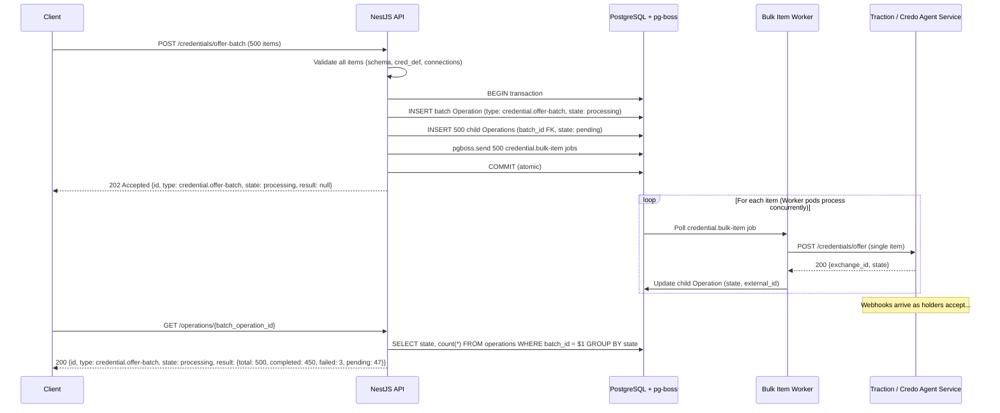
```mermaid
sequenceDiagram
    participant Client
    participant API as NestJS API
    participant PG as PostgreSQL + pg-boss
    participant Worker as Bulk Item Worker
    participant Agent as Traction / Credo Agent Service

    Client->>API: POST /credentials/offer-batch (500 items)
    API->>API: Validate all items (schema, cred_def, connections)
    API->>PG: BEGIN transaction
    API->>PG: INSERT batch Operation (type: credential.offer-batch, state: processing)
    API->>PG: INSERT 500 child Operations (batch_id FK, state: pending)
    API->>PG: pgboss.send 500 credential.bulk-item jobs
    API->>PG: COMMIT (atomic)
    API-->>Client: 202 Accepted {id, type: credential.offer-batch, state: processing, result: null}

    loop For each item (Worker pods process concurrently)
        PG->>Worker: Poll credential.bulk-item job
        Worker->>Agent: POST /credentials/offer (single item)
        Agent-->>Worker: 200 {exchange_id, state}
        Worker->>PG: Update child Operation (state, external_id)
    end

    Note over Agent: Webhooks arrive as holders accept...

    Client->>API: GET /operations/{batch_operation_id}
    API->>PG: SELECT state, count(*) FROM operations WHERE batch_id = $1 GROUP BY state
    API-->>Client: 200 {id, type: credential.offer-batch, state: processing, result: {total: 500, completed: 450, failed: 3, pending: 47}}
```

**Safeguards:**
- Max batch size: 500 items per request (configurable via `BULK_MAX_BATCH_SIZE`)
- Max concurrent batches per tenant: 3 (prevents a single tenant from monopolizing workers)
- pg-boss `teamConcurrency` controls per-worker parallelism (default: 5 concurrent bulk-item jobs per worker pod)
- Validation happens synchronously in the API handler (fail fast on bad data before enqueuing)
- `singletonKey` per `(tenant_id, connection_id)` prevents duplicate offers to the same connection within a batch

---

## Authentication & Authorization

### Design Decision: App as OIDC Provider

The app runs its own OpenID-certified OIDC provider (via [`oidc-provider`](https://github.com/panva/node-oidc-provider)) and owns all token issuance, client registration, and permission management. Keycloak serves only as the **upstream identity federation** — users prove their identity via Keycloak, then the app issues its own access tokens with custom claims derived from the app's permission database.

**Why:**
- Zero Keycloak Admin API dependency — no client lifecycle calls to external service
- Full control over permission granularity (tenant-scoped, resource-scoped)
- Standards-compliant `client_credentials` grant with `.well-known/openid-configuration` auto-generated
- Portable — swap Keycloak for any OIDC provider without touching permission logic
- Single token format — app-issued JWTs for both users and API clients

### Architecture Layers

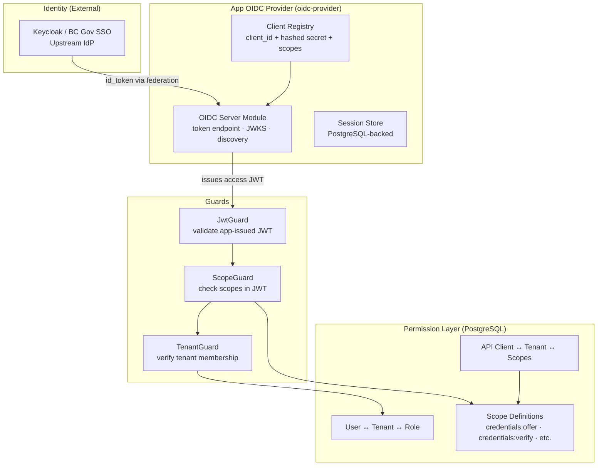
```mermaid
graph TD
    subgraph "Identity (External)"
        KC[Keycloak / BC Gov SSO<br/>Upstream IdP]
    end

    subgraph "App OIDC Provider (oidc-provider)"
        OIDC[OIDC Server Module<br/>token endpoint · JWKS · discovery]
        CLIENTS[Client Registry<br/>client_id + hashed secret + scopes]
        SESSIONS[Session Store<br/>PostgreSQL-backed]
    end

    subgraph "Permission Layer (PostgreSQL)"
        USERS[User ↔ Tenant ↔ Role]
        SCOPES[Scope Definitions<br/>credentials:offer · credentials:verify · etc.]
        APICLIENTS[API Client ↔ Tenant ↔ Scopes]
    end

    subgraph "Guards"
        G1[JwtGuard<br/>validate app-issued JWT]
        G2[ScopeGuard<br/>check scopes in JWT]
        G3[TenantGuard<br/>verify tenant membership]
    end

    KC -->|id_token via federation| OIDC
    OIDC -->|issues access JWT| G1
    G1 --> G2 --> G3
    G2 --> SCOPES
    G3 --> USERS
    CLIENTS --> OIDC
    APICLIENTS --> SCOPES
```

### Token Flows

#### User Login (Browser → Federated OIDC)

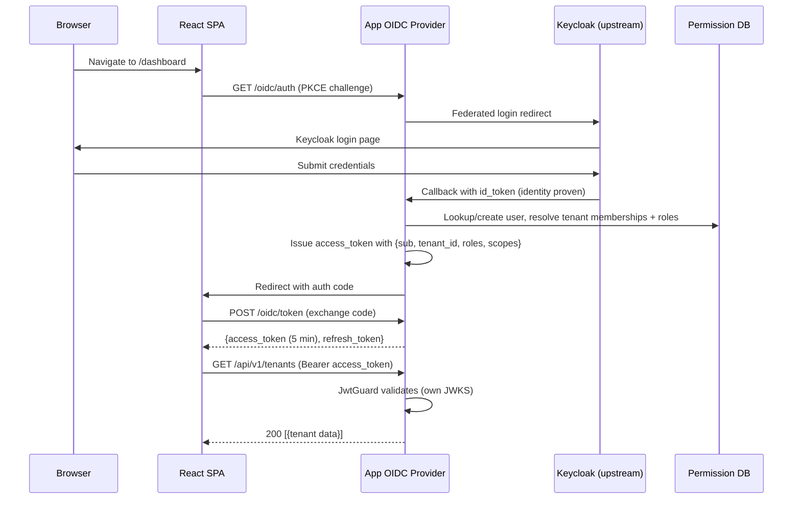
```mermaid
sequenceDiagram
    participant Browser
    participant SPA as React SPA
    participant App as App OIDC Provider
    participant KC as Keycloak (upstream)
    participant DB as Permission DB

    Browser->>SPA: Navigate to /dashboard
    SPA->>App: GET /oidc/auth (PKCE challenge)
    App->>KC: Federated login redirect
    KC->>Browser: Keycloak login page
    Browser->>KC: Submit credentials
    KC->>App: Callback with id_token (identity proven)
    App->>DB: Lookup/create user, resolve tenant memberships + roles
    App->>App: Issue access_token with {sub, tenant_id, roles, scopes}
    App->>SPA: Redirect with auth code
    SPA->>App: POST /oidc/token (exchange code)
    App-->>SPA: {access_token (5 min), refresh_token}
    SPA->>App: GET /api/v1/tenants (Bearer access_token)
    App->>App: JwtGuard validates (own JWKS)
    App-->>SPA: 200 [{tenant data}]
```

#### API Client (client_credentials grant)

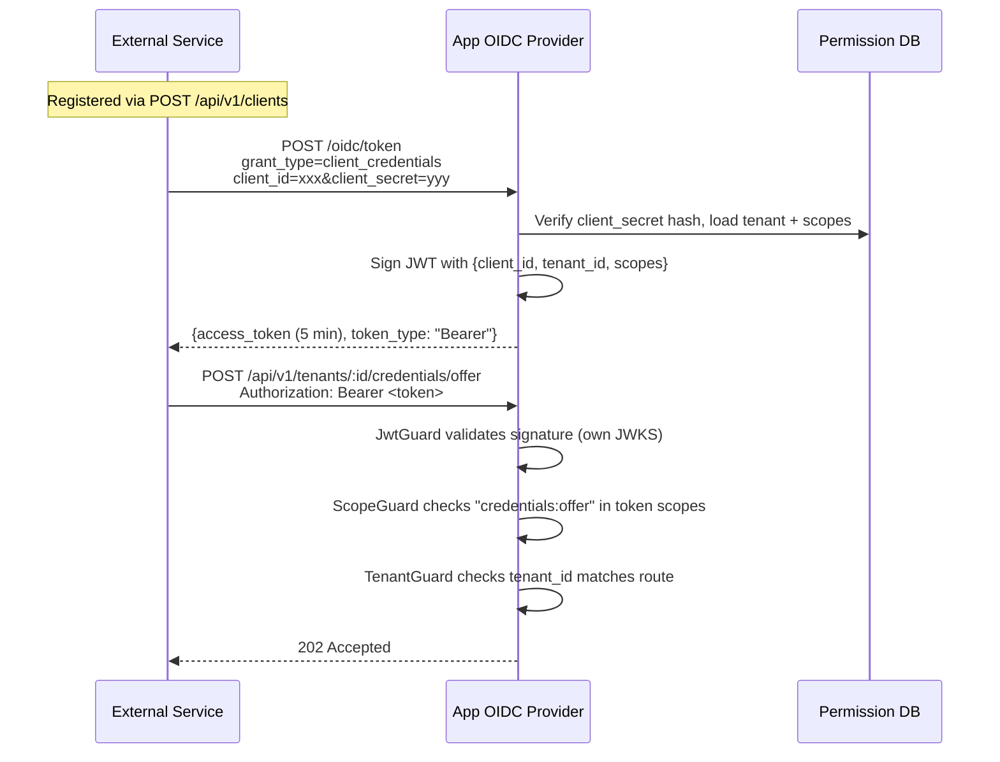
```mermaid
sequenceDiagram
    participant Service as External Service
    participant App as App OIDC Provider
    participant DB as Permission DB

    Note over Service: Registered via POST /api/v1/clients

    Service->>App: POST /oidc/token<br/>grant_type=client_credentials<br/>client_id=xxx&client_secret=yyy
    App->>DB: Verify client_secret hash, load tenant + scopes
    App->>App: Sign JWT with {client_id, tenant_id, scopes}
    App-->>Service: {access_token (5 min), token_type: "Bearer"}
    Service->>App: POST /api/v1/tenants/:id/credentials/offer<br/>Authorization: Bearer <token>
    App->>App: JwtGuard validates signature (own JWKS)
    App->>App: ScopeGuard checks "credentials:offer" in token scopes
    App->>App: TenantGuard checks tenant_id matches route
    App-->>Service: 202 Accepted
```

### OIDC Endpoints (auto-generated by oidc-provider)

| Endpoint | Purpose |
|----------|--------|
| `GET /oidc/.well-known/openid-configuration` | Discovery document |
| `GET /oidc/jwks` | Public keys for JWT verification |
| `POST /oidc/token` | Token issuance (`client_credentials`, `authorization_code`, `refresh_token`) |
| `GET /oidc/auth` | Authorization endpoint (user login flow) |
| `POST /oidc/token/introspection` | Token introspection (RFC 7662) |
| `POST /oidc/token/revocation` | Token revocation (RFC 7009) |

### Authorization Model


```mermaid
graph TD
    subgraph "Role Hierarchy (app DB)"
        PA[platform-admin<br/><i>bypasses all guards</i>] --> TO[owner]
        TO --> TA[admin]
        TA --> TM[member]
        TM --> RO[readonly]
    end

    subgraph "Scope Hierarchy (leveled)"
        direction TB
        L1["Level 1: tenants:admin<br/><i>tenant superuser — implicitly grants all below</i>"]
        L2a[credentials:offer]
        L2b[credentials:verify]
        L2c[credentials:hold]
        L2d[credentials:revoke]
        L2e[connections:manage]
        L2f[profiles:manage]
        L2g[users:manage]
        L2h[clients:manage]
        L3a[logs:read]
        L1 -.->|implicit| L2a
        L1 -.->|implicit| L2b
        L1 -.->|implicit| L2c
        L1 -.->|implicit| L2d
        L1 -.->|implicit| L2e
        L1 -.->|implicit| L2f
        L1 -.->|implicit| L2g
        L1 -.->|implicit| L2h
        L1 -.->|implicit| L3a
    end

    subgraph "Guards (evaluated in order)"
        G1[1. JwtGuard<br/>Verify app-issued JWT signature + expiry]
        G2[2. ScopeGuard<br/>Token scopes include required scope?<br/><i>OR token has tenants:admin</i>]
        G3[3. TenantGuard<br/>sub/client has membership in target tenant?]
    end

    G1 --> G2 --> G3
```

**Key rules:**
- Every API endpoint requires a valid app-issued JWT (JwtGuard)
- Scopes are checked at the guard level — token must contain the scope required by the endpoint
- `tenants:admin` is a **tenant superuser scope** — ScopeGuard treats it as having ALL Level 2 + Level 3 scopes
- Users get scopes derived from their role (role→scope mapping in DB)
- API clients get explicitly assigned scopes at registration time
- Tenant isolation enforced separately — valid token + correct scope + wrong tenant = 403
- `platform-admin` role bypasses ScopeGuard and TenantGuard entirely (not a scope — checked by role)

**Role → scope mappings (seed):**
| Role | Scopes |
|------|--------|
| platform-admin | _bypasses guards_ |
| owner | tenants:admin (superuser — implicitly has all) |
| admin | credentials:offer, credentials:verify, connections:manage, profiles:manage, users:manage, clients:manage, logs:read |
| member | credentials:offer, credentials:verify |
| readonly | _(no scopes — GET endpoints only)_ |

### JWT Claims Structure (App-Issued)

```json
{
  "sub": "a3f8c2d1-...",
  "client_id": null,
  "email": "user@example.com",
  "tenant_id": "b7e4a1f0-...",
  "roles": ["admin"],
  "scope": "credentials:offer credentials:verify connections:manage profiles:manage",
  "aud": "vc-common-service",
  "iss": "https://vc-common.example.com/oidc",
  "exp": 1718500300,
  "iat": 1718500000
}
```

For API clients (`client_credentials` grant):
```json
{
  "sub": "client:ext-service-1",
  "client_id": "ext-service-1",
  "tenant_id": "b7e4a1f0-...",
  "roles": [],
  "scope": "credentials:offer credentials:verify",
  "aud": "vc-common-service",
  "iss": "https://vc-common.example.com/oidc",
  "exp": 1718500300,
  "iat": 1718500000
}
```

### Key Libraries

| Library | Role |
|---------|------|
| [`oidc-provider`](https://github.com/panva/node-oidc-provider) | OpenID Certified OIDC server — handles token signing, JWKS, discovery, grants, key rotation |
| [`jose`](https://github.com/panva/jose) | Low-level JWT/JWK operations (used internally by oidc-provider; available for custom needs) |
| `argon2` | Client secret hashing |
| `passport-openidconnect` | Federation with upstream Keycloak for user login |
| PostgreSQL | Session/grant storage adapter for oidc-provider (custom adapter using TypeORM) |

---

## Data Architecture

### Multi-Tenancy Strategy

The system uses **shared database, shared schema** with tenant isolation enforced at the application layer (row-level filtering via `tenant_id` foreign keys).

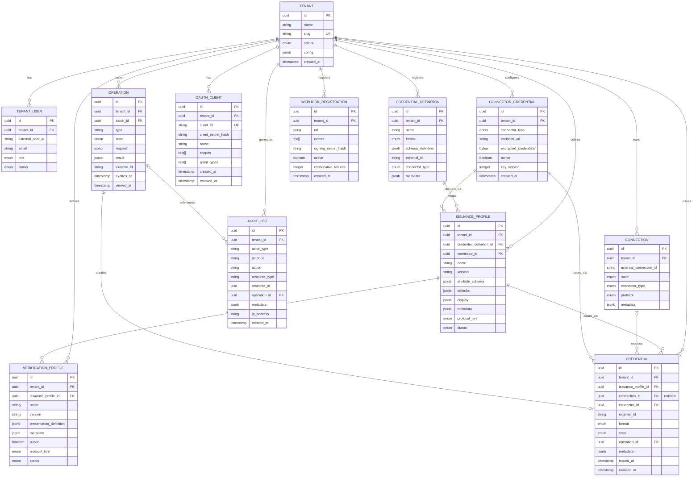
```mermaid
erDiagram
    TENANT ||--o{ TENANT_USER : has
    TENANT ||--o{ CREDENTIAL_DEFINITION : registers
    TENANT ||--o{ ISSUANCE_PROFILE : defines
    TENANT ||--o{ VERIFICATION_PROFILE : defines
    TENANT ||--o{ CONNECTION : owns
    TENANT ||--o{ CREDENTIAL : issues
    TENANT ||--o{ OPERATION : tracks
    TENANT ||--o{ OAUTH_CLIENT : has
    TENANT ||--o{ CONNECTOR_CREDENTIAL : configures
    TENANT ||--o{ AUDIT_LOG : generates
    TENANT ||--o{ WEBHOOK_REGISTRATION : registers
    CREDENTIAL_DEFINITION ||--o{ ISSUANCE_PROFILE : wraps
    ISSUANCE_PROFILE ||--o{ VERIFICATION_PROFILE : verifies
    ISSUANCE_PROFILE ||--o{ CREDENTIAL : issues_via
    CONNECTOR_CREDENTIAL ||--o{ ISSUANCE_PROFILE : delivers_via
    CONNECTION |o--o{ CREDENTIAL : receives
    CONNECTOR_CREDENTIAL ||--o{ CREDENTIAL : issues_via
    OPERATION ||--o| CREDENTIAL : creates
    OPERATION |o--o{ AUDIT_LOG : references

    TENANT {
        uuid id PK
        string name
        string slug UK
        enum status
        jsonb config
        timestamp created_at
    }

    TENANT_USER {
        uuid id PK
        uuid tenant_id FK
        string external_user_id
        string email
        enum role
        enum status
    }

    CREDENTIAL_DEFINITION {
        uuid id PK
        uuid tenant_id FK
        string name
        enum format
        jsonb schema_definition
        string external_id
        enum connector_type
        jsonb metadata
    }

    ISSUANCE_PROFILE {
        uuid id PK
        uuid tenant_id FK
        uuid credential_definition_id FK
        uuid connector_id FK
        string name
        string version
        jsonb attribute_schema
        jsonb defaults
        jsonb display
        jsonb metadata
        enum protocol_hint
        enum status
    }

    VERIFICATION_PROFILE {
        uuid id PK
        uuid tenant_id FK
        uuid issuance_profile_id FK
        string name
        string version
        jsonb presentation_definition
        jsonb metadata
        boolean public
        enum protocol_hint
        enum status
    }

    CONNECTION {
        uuid id PK
        uuid tenant_id FK
        string external_connection_id
        enum state
        enum connector_type
        enum protocol
        jsonb metadata
    }

    OAUTH_CLIENT {
        uuid id PK
        uuid tenant_id FK
        string client_id UK
        string client_secret_hash
        string name
        text[] scopes
        text[] grant_types
        timestamp created_at
        timestamp revoked_at
    }

    CREDENTIAL {
        uuid id PK
        uuid tenant_id FK
        uuid issuance_profile_id FK
        uuid connection_id FK "nullable"
        uuid connector_id FK
        string external_id
        enum format
        enum state
        uuid operation_id FK
        jsonb metadata
        timestamp issued_at
        timestamp revoked_at
    }

    OPERATION {
        uuid id PK
        uuid tenant_id FK
        uuid batch_id FK
        string type
        enum state
        jsonb request
        jsonb result
        string external_id
        timestamp expires_at
        timestamp viewed_at
    }

    CONNECTOR_CREDENTIAL {
        uuid id PK
        uuid tenant_id FK
        enum connector_type
        string endpoint_url
        bytea encrypted_credentials
        boolean active
        integer key_version
        timestamp created_at
    }

    AUDIT_LOG {
        uuid id PK
        uuid tenant_id FK
        string actor_type
        string actor_id
        string action
        string resource_type
        uuid resource_id
        uuid operation_id FK
        jsonb metadata
        string ip_address
        timestamp created_at
    }

    WEBHOOK_REGISTRATION {
        uuid id PK
        uuid tenant_id FK
        string url
        text[] events
        string signing_secret_hash
        boolean active
        integer consecutive_failures
        timestamp created_at
    }
```

> **Note on timestamps:** All entities include `created_at` and `updated_at` columns unless shown otherwise. The ER diagram shows only structurally significant fields; audit timestamps are omitted for brevity.

**Why shared schema (not schema-per-tenant or DB-per-tenant):**
- Simpler operations: single migration target, single connection pool
- BC Gov OpenShift typically provisions one PostgreSQL instance per app
- Tenant count expected in dozens, not thousands
- Row-level filtering is adequate; PostgreSQL RLS can be layered later if needed

---

## Deployment Architecture

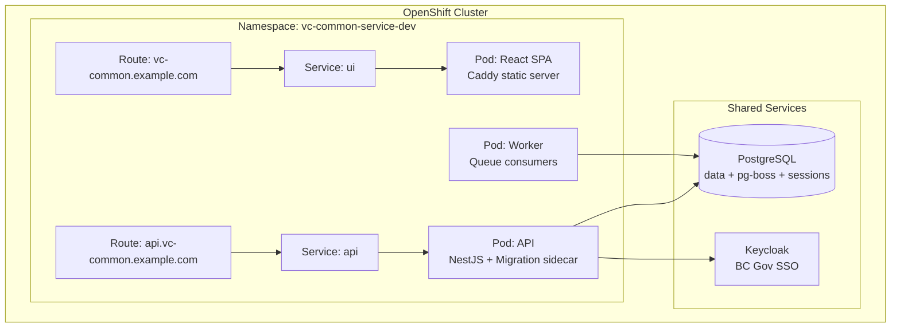
```mermaid
graph TB
    subgraph "OpenShift Cluster"
        subgraph "Namespace: vc-common-service-dev"
            POD_API[Pod: API<br/>NestJS + Migration sidecar]
            POD_WORKER[Pod: Worker<br/>Queue consumers]
            POD_UI[Pod: React SPA<br/>Caddy static server]
            SVC_API[Service: api]
            SVC_UI[Service: ui]
            ROUTE_API[Route: api.vc-common.example.com]
            ROUTE_UI[Route: vc-common.example.com]
        end

        subgraph "Shared Services"
            PG_POD[(PostgreSQL<br/>data + pg-boss + sessions)]
            KC_POD[Keycloak<br/>BC Gov SSO]
        end
    end

    ROUTE_UI --> SVC_UI --> POD_UI
    ROUTE_API --> SVC_API --> POD_API
    POD_API --> PG_POD
    POD_WORKER --> PG_POD
    POD_API --> KC_POD
```

**Notes:**
- API and Worker share the same container image; differentiated by entrypoint command
- Migrations run as init container in the API pod
- Horizontal scaling: API pods are stateless (scale freely); Worker pods use pg-boss `teamSize` + `teamConcurrency` for competing consumers
- NetworkPolicy restricts ingress to routes only; inter-pod communication explicit

---

## Security Considerations

| Concern | Mitigation |
|---------|-----------|
| Tenant data isolation | `tenant_id` FK on all data; TenantGuard enforces at request level |
| Token issuance | App owns OIDC provider (`oidc-provider`); RS256 signing with auto-rotated keys; short-lived tokens (5 min) |
| Client secret storage | Argon2 hash; full secret shown only once at registration |
| Credential at rest | Connector credentials encrypted with app-level key (AES-256-GCM) |
| Token security | No long-lived tokens; refresh rotation; PostgreSQL-backed session store |
| Scope enforcement | Scopes embedded in JWT claims; ScopeGuard checks every request |
| Webhook integrity | HMAC-SHA256 signature on every payload; tenant-specific signing secret |
| Rate limiting | Per-tenant sliding window in PostgreSQL (`rate_limit_hits` table); prevents resource exhaustion |
| Audit trail | Append-only log; no UPDATE/DELETE on audit table |
| Network | OpenShift NetworkPolicy; TLS everywhere; no plaintext internal traffic |
| Federation | Keycloak used for identity only; no Admin API calls; swappable upstream |

---

## Error Handling Strategy

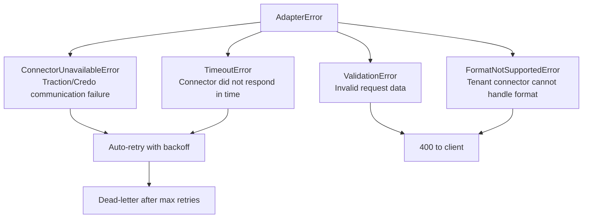
```mermaid
graph TD
    AE[AdapterError] --> ConnE[ConnectorUnavailableError<br/>Traction/Credo communication failure]
    AE --> ValE[ValidationError<br/>Invalid request data]
    AE --> TimeE[TimeoutError<br/>Connector did not respond in time]
    AE --> FormatE[FormatNotSupportedError<br/>Tenant connector cannot handle format]

    ConnE --> Retry[Auto-retry with backoff]
    TimeE --> Retry
    ValE --> Reject[400 to client]
    FormatE --> Reject
    Retry --> DLQ[Dead-letter after max retries]
```

All errors are:
- Logged with correlation ID (tenant + request ID)
- Mapped to appropriate HTTP status codes at the controller level
- Recorded in audit log for credential operations
- Surfaced to tenant via webhook if registered

---

## Observability (Post-MVP)

The service uses **OpenTelemetry** (OTel) as the single observability framework for traces, metrics, and logs. This avoids vendor lock-in and aligns with CNCF standards already adopted in BC Gov OpenShift clusters.

### Tenant Log Streaming (MVP)

While full OTel instrumentation is post-MVP, **tenant-scoped log access is an MVP requirement** — tenants need self-serve visibility into their credential operations because the agent backend (Traction) is a managed black-box they cannot access directly.

#### Architecture

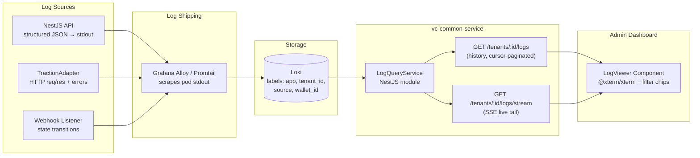
```mermaid
flowchart LR
    subgraph Sources ["Log Sources"]
        API[NestJS API<br/>structured JSON → stdout]
        Adapter[TractionAdapter<br/>HTTP req/res + errors]
        Webhook[Webhook Listener<br/>state transitions]
    end
    subgraph Ship ["Log Shipping"]
        Alloy[Grafana Alloy / Promtail<br/>scrapes pod stdout]
    end
    subgraph Store ["Storage"]
        Loki[(Loki<br/>labels: app, tenant_id,<br/>source, wallet_id)]
    end
    subgraph Proxy ["vc-common-service"]
        LQS[LogQueryService<br/>NestJS module]
        REST["GET /tenants/:id/logs<br/>(history, cursor-paginated)"]
        SSE["GET /tenants/:id/logs/stream<br/>(SSE live tail)"]
    end
    subgraph UI ["Admin Dashboard"]
        Viewer[LogViewer Component<br/>@xterm/xterm + filter chips]
    end

    API --> Alloy
    Adapter --> Alloy
    Webhook --> Alloy
    Alloy --> Loki
    Loki --> LQS
    LQS --> REST
    LQS --> SSE
    REST --> Viewer
    SSE --> Viewer
```

#### Label Taxonomy

Every log line emitted by vc-common-service includes labels for Loki indexing:

| Label | Cardinality | Source |
|-------|-------------|--------|
| `app` | Low (1-2) | `vc-common-service` (or `traction` for raw agent logs) |
| `tenant_id` | Medium | Extracted from AsyncLocalStorage request context |
| `source` | Low (4 values) | `api`, `adapter:traction`, `adapter:credo`, `webhook` |
| `wallet_id` | Medium | Traction sub-tenant ID (only on `app=traction` streams) |

Structured metadata (Loki 3.x) or JSON fields (queryable with `| json`):
- `operation_id`, `request_id`, `level`, `traction_state`, `traction_endpoint`, `error_code`, `duration_ms`

#### Consolidated Stream Design

A single endpoint returns an interleaved timeline from all sources:

```
GET /api/v1/tenants/:id/logs?source=all              ← default, all sources interleaved
GET /api/v1/tenants/:id/logs?source=api              ← vc-common-service only
GET /api/v1/tenants/:id/logs?source=adapter:traction ← Traction adapter interactions
GET /api/v1/tenants/:id/logs?source=agent:traction   ← Raw Traction pod logs (if available)
```

LogQL generation (server-side, tenant can never modify stream selector):

```logql
# Consolidated: vc-service + adapter interactions
{app="vc-common-service", tenant_id="<from-jwt>"}

# Include raw Traction agent logs (wallet_id resolved from ConnectorCredential)
{app="vc-common-service", tenant_id="<from-jwt>"} or {app="traction", wallet_id="<from-db>"}

# Filtered by source
{app="vc-common-service", tenant_id="<from-jwt>", source="adapter:traction"}
```

#### Security: Tenant Isolation

```mermaid
sequenceDiagram
    participant Client as Tenant Client
    participant Guard as ScopeGuard + TenantGuard
    participant LQS as LogQueryService
    participant DB as ConnectorCredential Table
    participant Loki

    Client->>Guard: GET /tenants/:id/logs (Bearer JWT)
    Guard->>Guard: Validate JWT signature, extract tenant_id claim
    Guard->>Guard: Assert jwt.tenant_id == :id param
    Guard->>Guard: Assert token has logs:read scope
    Guard->>LQS: Authorized request (tenant_id from JWT)
    LQS->>DB: Find connector WHERE tenant_id AND type='traction'
    DB-->>LQS: { traction_tenant_id (decrypted) }
    LQS->>LQS: Build LogQL with tenant_id + wallet_id (server-side only)
    LQS->>Loki: Query (LogQL)
    Loki-->>LQS: Log entries
    LQS-->>Client: Paginated response / SSE events
```

**Key invariant**: The `tenant_id` and `wallet_id` in LogQL are **always resolved server-side** from the JWT claim and database lookup. No client-provided identifier ever reaches the stream selector.

Attack prevention:
- Tenant manipulates `wallet_id` in request → **no input path exists** (resolved from DB)
- Tenant registers another tenant's `traction_tenant_id` → blocked at connector creation (TM-07 validates ownership by authenticating against Traction and verifying tenant response)
- LogQL injection via search param → user input only appears in line filter (`|~`), sanitized/escaped, cannot modify stream selector

#### Adapter Instrumentation Points

| Layer | What to capture | Source label |
|-------|----------------|--------------|
| **HTTP outbound to Traction** | method, path, status, duration_ms, error_code | `adapter:traction` |
| **Traction response parsing** | external_id (cred_ex_id, thread_id), state | `adapter:traction` |
| **Webhook ingestion** | topic, state transition, connection_id, thread_id | `webhook` |
| **Token lifecycle** | token_refreshed, token_failed, cached hit/miss | `adapter:traction` |
| **Error interpretation** | map Traction error → actionable message + suggestion | `adapter:traction` |
| **Credo Agent Service events (post-MVP)** | CredentialStateChanged, ProofStateChanged, DIDComm messages (via webhook callback from Credo Agent Service) | `adapter:credo` |

Redaction rules: never log `api_key`, credential claim values, DID private keys. Log: DIDs, connection_ids, thread_ids (public identifiers), operation_ids, cred_def_ids.

#### Frontend: Log Viewer Component

Uses `@xterm/xterm` (the terminal emulator powering VS Code's terminal) for a console-like experience:
- Full ANSI color support for log levels (red=error, yellow=warn, green=info, gray=debug)
- Virtual scrolling for large log histories (handles 100k+ lines)
- Search within buffer (Ctrl+F / Cmd+F)
- Auto-scroll with pause on manual scroll-up
- Copy selection to clipboard
- Monospace font, dark theme (terminal aesthetic)

Combined with filter controls:
- Source chips: toggle `api` / `adapter:traction` / `agent:traction` visibility
- Level dropdown: debug / info / warn / error (default: info+)
- Search input: free-text filter (becomes LogQL `|~` regex)
- Time range: live tail / last 1h / 6h / 24h / custom range
- Operation ID deep-link: click operation → filtered log view for that operation

### Architecture

```mermaid
graph LR
    subgraph "Application Pod"
        APP[NestJS API / Worker]
        SDK[OTel SDK<br/>auto + manual instrumentation]
        APP --> SDK
    end

    SDK -->|OTLP/gRPC| COLLECTOR[OTel Collector<br/>sidecar or DaemonSet]

    COLLECTOR -->|traces| TEMPO[Tempo / Jaeger]
    COLLECTOR -->|metrics| PROM[Prometheus]
    COLLECTOR -->|logs| LOKI[Loki / Elasticsearch]

    PROM --> GRAFANA[Grafana Dashboards]
    TEMPO --> GRAFANA
    LOKI --> GRAFANA
```

### Instrumentation Strategy

| Layer | Method | What it captures |
|-------|--------|-----------------|
| HTTP (inbound) | Auto-instrumentation | Route, method, status, duration, request size |
| HTTP (outbound) | Auto-instrumentation | Calls to Traction/Credo Agent Service backends with full timing |
| PostgreSQL | Auto-instrumentation (`pg`) | Query text (sanitized), duration, row count |
| OIDC sessions | Manual spans | session.create, session.destroy, grant.upsert |
| pg-boss | Manual spans | job.send, job.complete, job.fail, queue name, duration |
| Adapter layer | Manual spans | adapter.resolve, adapter.offerCredential, adapter.requestPresentation |
| Operations | Manual spans | operation.create, operation.stateTransition, operation_id as attribute |
| OIDC Provider | Manual spans | token.issue, token.introspect, client.authenticate |

### Trace Context Propagation

```
Client → API Pod → Traction/Credo Agent Service
  │                    │
  └── W3C traceparent header propagated across all HTTP calls
       trace_id embedded in every log line for correlation
```

- **W3C TraceContext** propagation for distributed traces
- `trace_id` injected into every structured log line → seamless log-to-trace navigation
- `tenant_id` and `operation_id` added as span attributes for filtering by tenant or credential operation

### Structured Logging

```json
{
  "timestamp": "2025-01-15T10:30:00.000Z",
  "level": "info",
  "message": "Credential offer created",
  "service": "vc-common-service",
  "trace_id": "abc123def456",
  "span_id": "789ghi",
  "tenant_id": "tenant-uuid",
  "operation_id": "op-uuid",
  "adapter": "traction",
  "format": "anoncreds",
  "duration_ms": 142
}
```

- **pino** JSON logger (high-performance, low-overhead)
- Request-scoped context via `AsyncLocalStorage` or OTel context
- Sensitive fields (tokens, credential attributes, secrets) redacted automatically
- Output to stdout — collected by platform log aggregator (Fluentd/Fluent Bit → Loki)

### Key Metrics

| Metric | Type | Labels |
|--------|------|--------|
| `http_requests_total` | Counter | method, route, status, tenant_id |
| `http_request_duration_seconds` | Histogram | method, route, tenant_id |
| `credential_operations_total` | Counter | type, state, format, tenant_id |
| `operations_pending_count` | Gauge | tenant_id |
| `adapter_calls_total` | Counter | adapter, method, success |
| `adapter_call_duration_seconds` | Histogram | adapter, method |
| `webhook_deliveries_total` | Counter | tenant_id, status |
| `pgboss_queue_depth` | Gauge | queue_name |

### Health Endpoints

| Endpoint | Purpose | Checks |
|----------|---------|--------|
| `GET /health/live` | Liveness probe | Process running |
| `GET /health/ready` | Readiness probe | DB, pg-boss, oidc-provider |

Uses `@nestjs/terminus` with custom health indicators. Returns degraded (200 + warning body) if non-critical dependency is unavailable, unhealthy (503) if critical.

### Collector Deployment

- **Sidecar pattern** in dev/test (simple, isolated per pod)
- **DaemonSet** in prod (shared, resource-efficient across pods)
- Receivers: OTLP (gRPC:4317, HTTP:4318)
- Processors: `batch`, `memory_limiter`, `k8s_attributes` (inject pod/namespace metadata)
- Exporters: environment-specific (stdout in dev, Tempo/Prometheus/Loki in prod)
- Configured via Helm values — no application code changes between environments

### Why Post-MVP

OTel instrumentation is **additive and non-breaking** — the application architecture is designed so that:
1. All log output already goes to stdout (container-native from day one)
2. Health endpoints can be added without changing business logic
3. Auto-instrumentation requires only a `--require` flag or small bootstrap change
4. Manual spans are added via decorators/interceptors — no service logic changes
5. Collector is a separate deployment concern (Helm values only)
